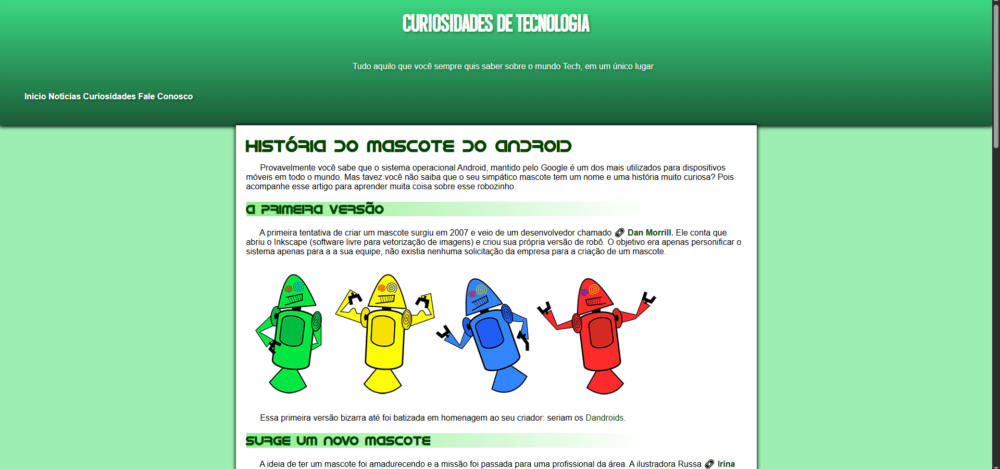

# 📱 Projeto Android - Curso em Vídeo

Este é um projeto desenvolvido como parte do curso de **HTML5 e CSS3** ministrado pelo professor **Gustavo Guanabara**, disponível gratuitamente no portal [Curso em Vídeo](https://www.cursoemvideo.com).

O desafio consiste na criação de uma **página web responsiva** para apresentar um artigo sobre o sistema operacional **Android**, utilizando os conhecimentos adquiridos ao longo do curso.

---

## 📌 Objetivos do Projeto

- Utilizar as principais **tags semânticas** do HTML5;
- Aplicar **estilização com CSS3**, incluindo responsividade;
- Incorporar **imagens**, **vídeos** e **links externos**;
- Estruturar um site simples e funcional com foco em **boas práticas de front-end**.

---

## 🧰 Tecnologias Utilizadas

- HTML5
- CSS3

---

## 💻 Estrutura da Página

- **index.html**: Página principal com o conteúdo do artigo.
- **style.css**: Arquivo de estilos com layout e responsividade.
- **imagens/**: Pasta contendo as imagens usadas no projeto.
- **midia/**: Pasta com o vídeo incorporado (opcional).
- **favicon.ico**: Ícone da aba do navegador.

---

## 📱 Responsividade

A página foi desenvolvida para se adaptar a diferentes tamanhos de tela (desktop, tablet e celular), utilizando media queries e técnicas de design responsivo.

---

## 📸 Prévia do Projeto

---

## 🔗 Link do Projeto para Visualização

[🔗 Acesse o Projeto Online](https://stapani7.github.io/projeto-android)

---

## 📚 Créditos

Projeto desenvolvido com base no desafio **"Projeto Android"** do curso de **HTML5 e CSS3** por **Gustavo Guanabara** – [Curso em Vídeo](https://www.cursoemvideo.com).

---

